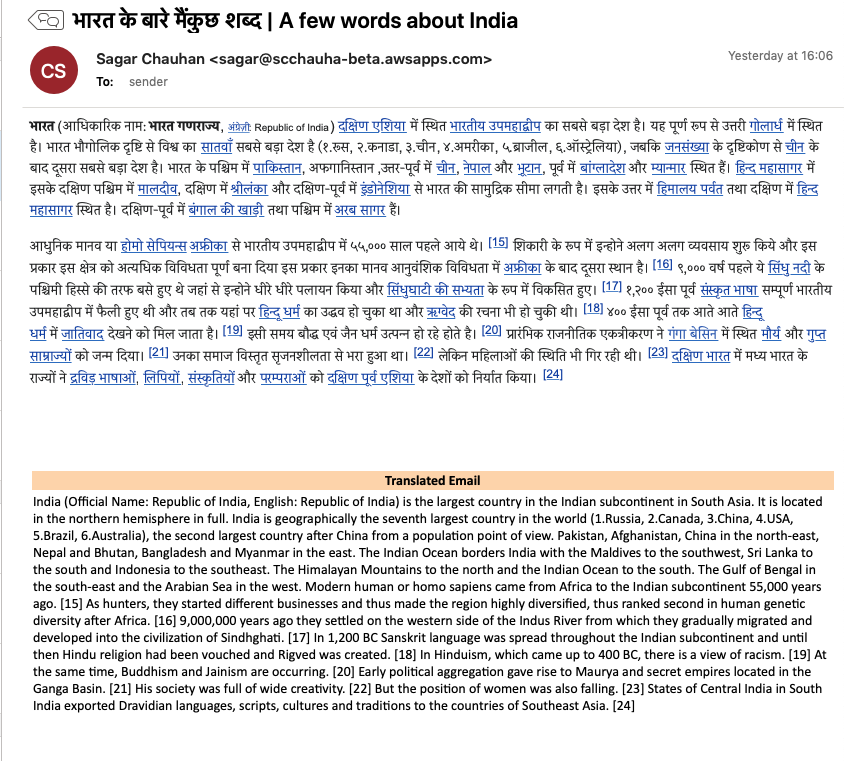

# Amazon WorkMail Translaste Email
This application translates a incoming or outgoing email into a language of your choice. 

Specifically, application automatically detects the language of a email and then translates subject and body into the destination language that you provide during setup. The translated body and subject is then appended to the original body and orginal subject of the email respectively.



## Development
### Using the AWS Lambda Console
1. Deploy this application via [AWS Serverless Application Repository](https://serverlessrepo.aws.amazon.com/applications/arn:aws:serverlessrepo:us-east-1:489970191081:applications~workmail-translate-email).
2. Enter [language code](https://docs.aws.amazon.com/translate/latest/dg/what-is.html#what-is-languages) of the language you want your email to be translated into.
3. Configure a synchronous Run Lambda rule over the Lambda function created in step 1. See [instructions.](https://docs.aws.amazon.com/workmail/latest/adminguide/lambda.html#synchronous-rules) 

It is possible to configure both inbound and outbound email flow rules over the same Lambda function.

You now have a working Lambda function that will be triggered by WorkMail based on the rule you created.

To further customize your Lambda function, open the [AWS Lambda Console](https://us-east-1.console.aws.amazon.com/lambda/home?region=us-east-1#/functions) to edit and test your Lambda function with the built-in code editor.

For more information, see [documentation](https://docs.aws.amazon.com/lambda/latest/dg/code-editor.html).

For more advanced use cases, such as changing your CloudFormation template to create additional AWS resources that will support this application, follow the instructions below.

## Developing locally
Clone this repository from [GitHub](https://github.com/aws-samples/amazon-workmail-lambda-templates).

We recommend creating and activating a virtual environment, for more information see [Creation of virtual environments](https://docs.python.org/3/library/venv.html).

If you are not familiar with CloudFormation templates, see [Learn Template Basics](https://docs.aws.amazon.com/AWSCloudFormation/latest/UserGuide/gettingstarted.templatebasics.html).

1. Create additional resources for your application by changing [template.yaml](https://github.com/aws-samples/amazon-workmail-lambda-templates/blob/master/workmail-translate-email/template.yaml). For more information, see [documentation](https://docs.aws.amazon.com/AWSCloudFormation/latest/UserGuide/template-reference.html).
2. Modify your Lambda function by changing [app.py](https://github.com/aws-samples/amazon-workmail-lambdas-templates/blob/master/workmail-translate-email/src/app.py).
3. Test your Lambda function locally:
    1. [Set up the SAM CLI](https://aws.amazon.com/serverless/sam/).
    2. Configure environment variables at `tst/env_vars.json`.
    3. Configure test event at `tst/event.json`.
    4. Invoke your Lambda function locally using:
    
        `$ sam local invoke WorkMailTranslateEmailFunction -e tst/event.json --env-vars tst/env_vars.json`

### Deployment
If you develop using the AWS Lambda Console, then this section can be skipped.

Please create an S3 bucket if you do not have one yet, see [How do I create an S3 Bucket?](https://docs.aws.amazon.com/AmazonS3/latest/user-guide/create-bucket.html).
and check how to create a [Bucket Policy](https://docs.aws.amazon.com/serverlessrepo/latest/devguide/serverlessrepo-how-to-publish.html#publishing-application-through-cli).
We refer to this bucket as `<Bucket-Name-For-Deployment>`.

This step bundles all your code and configuration to the given S3 bucket. 

```bash
$ sam package \
 --template-file template.yaml \
 --output-template-file packaged.yaml \
 --s3-bucket <Bucket-Name-For-Deployment>
```

This step updates your CloudFormation stack to reflect the changes you made, which will in turn update changes made in the Lambda function.
```bash
$ sam deploy \
  --template-file packaged.yaml \
  --stack-name workmail-translate-email \
  --parameter-overrides DestinationLanguage=<ENTER_DESTINATION_LANGUAGE_CODE> \
  --capabilities CAPABILITY_IAM
```
Your Lambda function is now deployed. You can now configure WorkMail to trigger this function.

## Frequently Asked Questions
### Where are the logs?
You can find the logs in CloudWatch. For more information see [Accessing Amazon CloudWatch logs for AWS Lambda](https://docs.aws.amazon.com/lambda/latest/dg/monitoring-cloudwatchlogs.html).

### How do I obtain a real message id for my `event.json` file?
1. Make sure your Lambda function prints out the message id from an event.
2. Deploy your Lambda function and add the Lambda rule to your WorkMail organization.
3. Send a test email from your WorkMail account.
4. Check your CloudWatch logs for a printed message id.

Note that you can access messages in transit for a maximum of one day.
