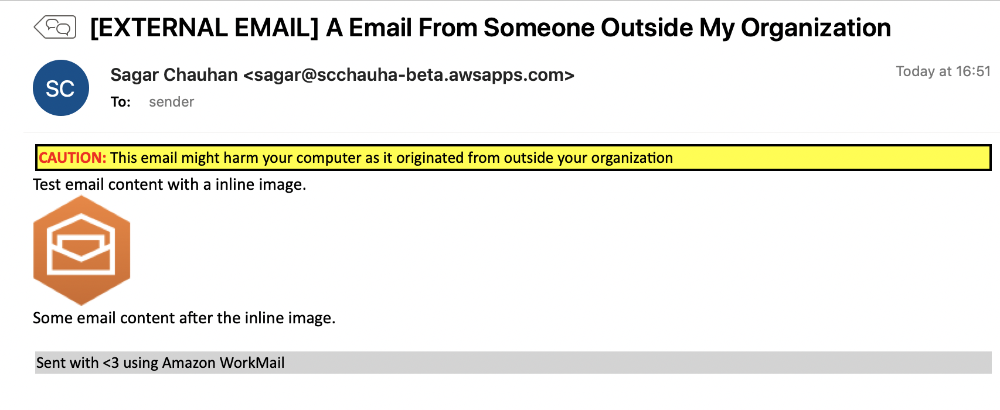

# Amazon WorkMail Update Email
This application enables you to add a customized disclaimer and footer in the body of emails as they are being sent or received.

Specifically, email messages sent from an external email address to your organization are updated with a disclaimer and footer. The subject of the email can also be prefixed with custom text, such as **"External Email"**. These set of features ensure that users in your organization are aware of emails originating from outside your organization.



Both a disclaimer and footer are optional and are only added if a value is provided during setup.

## Setup
1. Deploy this application via [AWS Serverless Application Repository](https://serverlessrepo.aws.amazon.com/applications/arn:aws:serverlessrepo:us-east-1:489970191081:applications~workmail-update-email).
    1. [Optional] Enter a disclaimer message you'd like to prepend in the email body.
    2. [Optional] Enter a footer message you'd like to append in the email body.
    3. [Optional] Enter a subject tag you'd like to prepend in the email subject, such as 'External'.
2. Configure a synchronous Run Lambda rule over the Lambda function created in step 1. See [instructions.](https://docs.aws.amazon.com/workmail/latest/adminguide/lambda.html#synchronous-rules) 

It is possible to configure both inbound and outbound email flow rules over the same Lambda function.

You now have a working Lambda function that will be triggered by WorkMail based on the rule you created.

To further customize your Lambda function, open the [AWS Lambda Console](https://us-east-1.console.aws.amazon.com/lambda/home?region=us-east-1#/functions) to edit and test your Lambda function with the built-in code editor.

If you would like to customize the way your disclaimer and footer are formatted. You can make a change [here](https://github.com/aws-samples/amazon-workmail-lambda-templates/blob/master/workmail-update-email/src/utils.py#L15). 

For more information, see [documentation](https://docs.aws.amazon.com/lambda/latest/dg/code-editor.html).

For more advanced use cases, such as changing your CloudFormation template to create additional AWS resources that will support this application, follow the instructions below.

## Access Control
By default, this serverless application and the resources that it creates can integrate with any [WorkMail Organization](https://docs.aws.amazon.com/workmail/latest/adminguide/organizations_overview.html) in your account, but the application and organization must be in the same region. To restrict that behavior you can either update the SourceArn attribute in [template.yaml](https://github.com/aws-samples/amazon-workmail-lambda-templates/blob/master/workmail-update-email/template.yaml)
and then deploy the application by following the steps below **or** update the SourceArn attribute directly in the resource policy of each resource via their AWS Console after the deploying this application, [see example](https://docs.aws.amazon.com/lambda/latest/dg/access-control-resource-based.html).

For more information about the SourceArn attribute, [see this documentation](https://docs.aws.amazon.com/IAM/latest/UserGuide/reference_policies_condition-keys.html#condition-keys-sourcearn).

## Development
Clone this repository from [GitHub](https://github.com/aws-samples/amazon-workmail-lambda-templates).

We recommend creating and activating a virtual environment, for more information see [Creation of virtual environments](https://docs.python.org/3/library/venv.html).

If you are not familiar with CloudFormation templates, see [Learn Template Basics](https://docs.aws.amazon.com/AWSCloudFormation/latest/UserGuide/gettingstarted.templatebasics.html).

1. Create additional resources for your application by changing [template.yaml](https://github.com/aws-samples/amazon-workmail-lambda-templates/blob/master/workmail-update-email/template.yaml). For more information, see [documentation](https://docs.aws.amazon.com/AWSCloudFormation/latest/UserGuide/template-reference.html).
2. Modify your Lambda function by changing [app.py](https://github.com/aws-samples/amazon-workmail-lambdas-templates/blob/master/workmail-update-email/src/app.py).
3. Test your Lambda function locally:
    1. [Set up the SAM CLI](https://aws.amazon.com/serverless/sam/).
    2. Configure environment variables at `tst/env_vars.json`.
    3. Configure test event at `tst/event.json`.
    4. Invoke your Lambda function locally using:
    
        `sam local invoke WorkMailUpdateEmailFunction -e tst/event.json --env-vars tst/env_vars.json`

### Test Message Ids
This application uses a `messageId` passed to the Lambda function to retrieve the message content from WorkMail. When testing, the `tst/event.json` file uses a mock messageId which does not exist. If you want to test with a real messageId, you can configure a WorkMail Email Flow Rule with the Lambda action that uses the Lambda function created in **Setup**, and send some emails that will trigger the email flow rule. The Lambda function will emit the messageId it receives from WorkMail in the CloudWatch logs, which you can
then use in your test event data. For more information see [Accessing Amazon CloudWatch logs for AWS Lambda](https://docs.aws.amazon.com/lambda/latest/dg/monitoring-cloudwatchlogs.html). Note that you can access messages in transit for a maximum of one day.

Once you have validated that your Lambda function behaves as expected, you are ready to deploy this Lambda function.

### Deployment
If you develop using the AWS Lambda Console, then this section can be skipped.

Please create an S3 bucket if you do not have one yet, see [How do I create an S3 Bucket?](https://docs.aws.amazon.com/AmazonS3/latest/user-guide/create-bucket.html).
and check how to create a [Bucket Policy](https://docs.aws.amazon.com/serverlessrepo/latest/devguide/serverlessrepo-how-to-publish.html#publishing-application-through-cli).
We refer to this bucket as `<Bucket-Name-For-Deployment>`.

This step bundles all your code and configuration to the given S3 bucket. 

```bash
sam build
```

```bash
sam package \
 --template-file template.yaml \
 --output-template-file packaged.yaml \
 --s3-bucket <Bucket-Name-For-Deployment>
```

This step updates your CloudFormation stack to reflect the changes you made, which will in turn update changes made in the Lambda function.
```bash
sam deploy \
  --template-file packaged.yaml \
  --stack-name workmail-update-email \
  --parameter-overrides Disclaimer=$YOUR_DISCLAIMER Footer=$YOUR_FOOTER SubjectTag=$YOUR_SUBJECT_TAG \
  --capabilities CAPABILITY_IAM
```
Your Lambda function is now deployed. You can now configure WorkMail to trigger this function.
