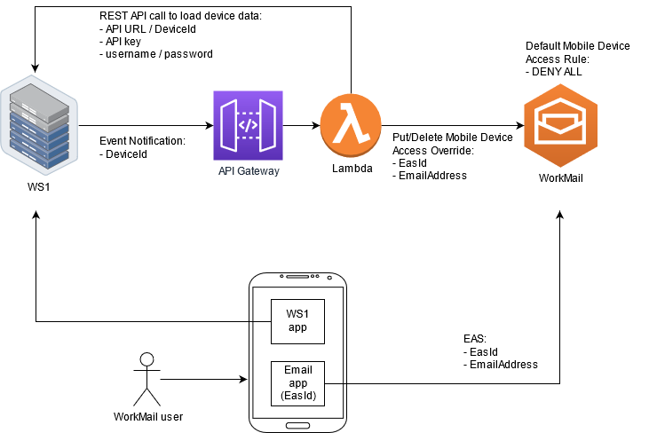

# Amazon WorkMail / VMware Workspace ONE UEM Integration

This application shows how to integrate WorkMail with VMware Workspace ONE UEM (WS1).



The high level overview:
- WorkMail user configures WS1 app on a mobile device
- device posture is communicated to WS1
- WS1 sends device posture change notification to API Gateway / Lambda
- Lambda loads device data from WS1, containing Exchange Device ID (EasId) and Compliance Status
- if device is Compliant, Mobile Device Access Override for user/device is added to WorkMail organization,
  allowing mobile device access
- WorkMail user configures WorkMail email account using Exchange ActiveSync (EAS) on the mobile device
  and gets email/calendar data 
- if device is not Compliant, Mobile Device Access Overrides for the device are removed from WorkMail organization, 
  blocking mobile device access
- because WokMail organization has a default Mobile Device Access Rule to DENY access to all mobile devices,
  user can't access email/calendar data

## Setup

1. Put the values in to `ws1creds.json` file: 

   1. `rest_api_url` & `rest_api_key` - can be found in "WS1 > GROUPS & SETTINGS > All Settings > System > Advanced > API > REST API"
   2. `rest_api_username` & `rest_api_password` - required credentials to call WS1 REST API    
   3. `event_notification_username` & `event_notification_password` - you can choose any values here; we will use 
      them later, when configuring Event Notifications in WS1

2. Upload `ws1creds.json` to AWS Secrets Manager:
   ```shell
   aws secretsmanager create-secret --name production/WS1Creds --secret-string file://ws1creds.json
   ```

3. Deploy this application via [AWS Serverless Application Repository](https://serverlessrepo.aws.amazon.com/applications/arn:aws:serverlessrepo:us-east-1:489970191081:applications~workmail-ws1-integration):

   1. enter your WorkMail organization id
   2. keep the default `production/WS1Creds` value
   3. after the deployment is complete, you should get `WorkMailWS1IntegrationEndpoint`; we will use it in the next 
      step

4. Configure Event Notifications in WS1:

   1. go to "WS1 > GROUPS & SETTINGS > All Settings > System > Advanced > API > Event Notifications"
   2. click "ADD RULE", enter:
      1. "Target Name" - WorkMail integration
      2. "Target URL" - the `WorkMailWS1IntegrationEndpoint` from the previous step
      3. "Username" & "Password" - use `event_notification_username` & `event_notification_password` from the `ws1creds.json`
      4. "Events" - enable all events
   3. click "TEST CONNECTION" - you should get Test is successful
   4. click "SAVE"

You now have a working Lambda function that will handle WS1 notifications and automatically update WorkMail 
organization to ALLOW access for compliant devices and DENY for non-compliant ones.   

If you'd like to customize your Lambda function, open the [AWS Lambda Console](https://console.aws.amazon.com/lambda) to edit and test your Lambda 
function with the built-in code editor. For more information, see [Documentation](https://docs.aws.amazon.com/lambda/latest/dg/code-editor.html).

For more advanced use cases, such as changing your CloudFormation template to create additional AWS resources that will support this application, follow the instructions below.

## Development

Clone this repository from [Github](https://raw.githubusercontent.com/aws-samples/amazon-workmail-lambda-templates/master/workmail-ws1-integration).

We recommend creating and activating a virtual environment, for more information see [Creation of virtual environments](https://docs.python.org/3/library/venv.html).

If you are not familiar with CloudFormation templates, see [Learn Template Basics](https://docs.aws.amazon.com/AWSCloudFormation/latest/UserGuide/gettingstarted.templatebasics.html).

1. Create additional resources for your application by changing [template.yaml](https://github.com/aws-samples/amazon-workmail-lambda-templates/blob/master/workmail-ws1-integration/template.yaml). For 
   more information, see [documentation](https://docs.aws.amazon.com/AWSCloudFormation/latest/UserGuide/template-reference.html).

2. Modify your Lambda function by changing [app.py](https://github.com/aws-samples/amazon-workmail-lambdas-templates/blob/master/workmail-ws1-integration/src/app.py).

3. Test your lambda function locally:
   
    1. [Set up the SAM CLI](https://aws.amazon.com/serverless/sam/).
   
    2. Put values to `ws1creds.json` and create/update a secret to AWS Secrets Manager:
        ```shell 
        aws secretsmanager create-secret --name production/WS1Creds --secret-string file://ws1creds.json
        aws secretsmanager update-secret --secret-id production/WS1Creds --secret-string file://ws1creds.json 
       ```

    3. Fill out files in `tst` folder with your corresponding values

### Testing
    
Testing Lambda locally:

- Test connection:
   ```shell
   sam local invoke WorkMailWS1IntegrationFunction -e tst/lambda_test_conection.json --env-vars tst/env_vars.json
   ```

- Test event notification:
   ```shell
   sam local invoke WorkMailWS1IntegrationFunction -e tst/lambda_event_notification.json --env-vars tst/env_vars.json
   ```

Testing API Gateway locally:
 
- Run:
   ```shell
   sam local start-api --env-vars tst/env_vars.json
   ```

- Test connection:
   ```shell
   curl -v http://127.0.0.1:3000/
   ```
   
- Test event notification:
   ```shell
   curl -XPOST -d @./tst/http_event_notification.json -v http://127.0.0.1:3000/ -H "Authorization: Basic XYZ"
   ```

### Deployment

```shell
sam deploy --guided
```

Your Lambda function is now deployed. The output will contain `WorkMailWS1IntegrationEndpoint` URL which you can use 
when configuring "WS1 > GROUPS & SETTINGS > All Settings > System > Advanced > API > Event Notifications".

## Troubleshooting 

### Where can I find logs?

The logs can be found in CloudWatch. To get more detailed logging, change the loglevel in 
[app.py](https://github.com/aws-samples/amazon-workmail-lambdas-templates/blob/master/workmail-ws1-integration/src/app.py) 
to `DEBUG`.

### WS1IntegrationException: EasId is missing - ignoring the event

This error happens when Email Profile is not (yet) deployed to the mobile device. 
Make sure that Email Profiles are configured and are deployed to mobile devices. Check WS1 documentation for more 
details.    

